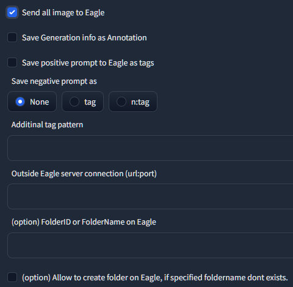
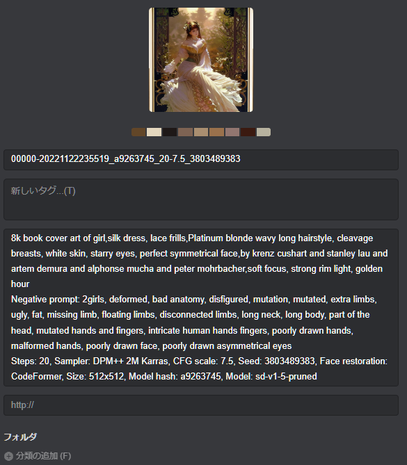

# Eagle-pnginfo

[English README](README.md)

- [AUTOMATIC1111's Stable Diffusion Web UI](https://github.com/AUTOMATIC1111/stable-diffusion-webui) 用の Extension です
- WebUIで生成した画像を、生成情報(プロンプト・Generation Info)を含めて、お手元の PC で動いている [Eagle](https://jp.eagle.cool/) (画像管理ソフト) へ転送・登録します

## インストール方法

- `Extensions` タブを開く

- `Install from URL` にこのレポジトリの URL を入力

- `Install` を実行

- 別途、PCへ [Eagle]([https://jp.eagle.cool/](https://jp.eagle.cool/) をインストールしておく

## 使い方 / How to use

- "設定" タブで、この Extension を有効にする

- 別途、"Eagle" アプリを立ち上げておく

- "AUTO1111" の Web UI を開き、いつも通り画像を生成する
  
   - 生成された画像は、自動的に Eagle アプリに登録されます

## 設定項目について

| In "Setting" tab                      |                                                                                                              |
| ------------------------------------- | ------------------------------------------------------------------------------------------------------------------------------- |
| "Send all image to Eagle"             | この Extension を有効にします                                                                                                            |
| FolderID on Eagle                     | (option: 必須ではありません) 画像を登録する Eagle 側のフォルダID を指定できます                                                                          |
| Save Generation info as Annotation    | PNGinfo に表示されるような、3行からなる生成情報を、Eagle の メモ欄に登録します                                                                                 |
| Save positive prompt to Eagle as tags | プロンプトを Eagle の tag として登録します                                                                                                     |
| Save negative prompt to Eagle as      | ネガティブプロンプトを Eagle の tag として登録します None: 登録しません tag: 登録します n:tag 登録します。登録時、タグ名の頭に "n:" をつけ、通常のプロンプトの tag と判別できるようにします |

## 設定サンプル

| Settings              | Result                | Comment                                                                                             |
| --------------------- | --------------------- | --------------------------------------------------------------------------------------------------- |
|    | No output to Eagle    |                                                                                                     |
|  |  | 画像を Eagle へ送ります                                                                                     |
|  |  | 画像を Eagle へ送ります Generation info 付き                                                              |
|  |  | 画像を Eagle へ送ります Generation info, tag, positive prompt 付き                                        |
|  |  | 画像を Eagle へ送ります Generation info, tag, negative　prompt 付き                                        |
|  |  | 画像を Eagle へ送ります Generation info, tag, negative　prompt 付き。< i.e.) n:bad anatomy                  |
|  |  | 画像を Eagle へ送ります Generation info, tag, positive prompt, negative prompt 付き。< i.e.) n:bad anatomy |
|  | FolderID              | "Eagle forlderID" を取得するには、Eagle UI で対象のフォルダを右クリックし、"copy link" を選択                                  |
|  |  | folderID を入れておくと、対象のフォルダに画像が格納されます                                                                  |
|  |                       | folderID の悪い例 コピーしたものをそのまま入力すると左画像のように長いパス名が入っていますが、必要になるのは右端の文字列のみです                           |
