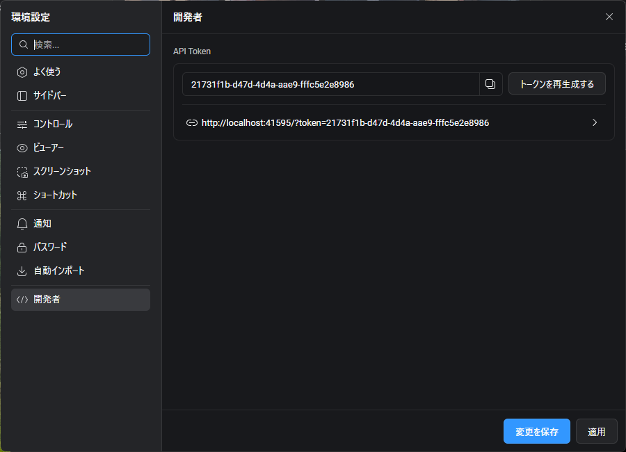
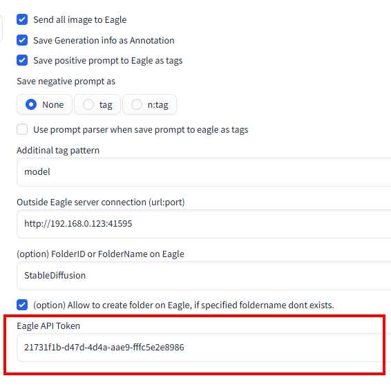

# Eagle Pnginfo (Eagle API Toke対応版)

- Stable Diffusion Web UIを動かしているマシンと、Eagleが別PCで動いているとき、設定は正しくされてるのに、localhost:41595 に送ろうとして失敗して画像が送れないことがあります。
- eagle-pnginfoをEagle API Tokeに対応させたFork版です。
- 設定画面にEagle API Tokenを入れて画像を送れるように改良してみました。

## Eagleの開発者タブ画面

## Eagle Pnginfo設定画面にAPI Token入力欄を追加

## 以下検索用
*** Error executing callback image_saved_callback for /home/mining/stable-diffusion-webui/extensions/sdweb-eagle-pnginfo/scripts/eagle-pnginfo.py
    Traceback (most recent call last):
      File "/home/mining/stable-diffusion-webui/venv/lib/python3.10/site-packages/urllib3/connection.py", line 199, in _new_conn
        sock = connection.create_connection(
      File "/home/mining/stable-diffusion-webui/venv/lib/python3.10/site-packages/urllib3/util/connection.py", line 85, in create_connection
        raise err
      File "/home/mining/stable-diffusion-webui/venv/lib/python3.10/site-packages/urllib3/util/connection.py", line 73, in create_connection
        sock.connect(sa)
    ConnectionRefusedError: [Errno 111] Connection refused

    The above exception was the direct cause of the following exception:

    Traceback (most recent call last):
      File "/home/mining/stable-diffusion-webui/venv/lib/python3.10/site-packages/urllib3/connectionpool.py", line 789, in urlopen
        response = self._make_request(
      File "/home/mining/stable-diffusion-webui/venv/lib/python3.10/site-packages/urllib3/connectionpool.py", line 495, in _make_request
        conn.request(
      File "/home/mining/stable-diffusion-webui/venv/lib/python3.10/site-packages/urllib3/connection.py", line 441, in request
        self.endheaders()
      File "/usr/lib/python3.10/http/client.py", line 1278, in endheaders
        self._send_output(message_body, encode_chunked=encode_chunked)
      File "/usr/lib/python3.10/http/client.py", line 1038, in _send_output
        self.send(msg)
      File "/usr/lib/python3.10/http/client.py", line 976, in send
        self.connect()
      File "/home/mining/stable-diffusion-webui/venv/lib/python3.10/site-packages/urllib3/connection.py", line 279, in connect
        self.sock = self._new_conn()
      File "/home/mining/stable-diffusion-webui/venv/lib/python3.10/site-packages/urllib3/connection.py", line 214, in _new_conn
        raise NewConnectionError(
    urllib3.exceptions.NewConnectionError: <urllib3.connection.HTTPConnection object at 0x75f1a29fe5c0>: Failed to establish a new connection: [Errno 111] Connection refused

    The above exception was the direct cause of the following exception:

    Traceback (most recent call last):
      File "/home/mining/stable-diffusion-webui/venv/lib/python3.10/site-packages/requests/adapters.py", line 667, in send
        resp = conn.urlopen(
      File "/home/mining/stable-diffusion-webui/venv/lib/python3.10/site-packages/urllib3/connectionpool.py", line 843, in urlopen
        retries = retries.increment(
      File "/home/mining/stable-diffusion-webui/venv/lib/python3.10/site-packages/urllib3/util/retry.py", line 519, in increment
        raise MaxRetryError(_pool, url, reason) from reason  # type: ignore[arg-type]
    urllib3.exceptions.MaxRetryError: HTTPConnectionPool(host='localhost', port=41595): Max retries exceeded with url: /api/folder/list (Caused by NewConnectionError('<urllib3.connection.HTTPConnection object at 0x75f1a29fe5c0>: Failed to establish a new connection: [Errno 111] Connection refused'))

    During handling of the above exception, another exception occurred:

    Traceback (most recent call last):
      File "/home/mining/stable-diffusion-webui/modules/script_callbacks.py", line 317, in image_saved_callback
        c.callback(params)
      File "/home/mining/stable-diffusion-webui/extensions/sdweb-eagle-pnginfo/scripts/eagle-pnginfo.py", line 102, in on_image_saved
        folderId = _get_folderId(shared.opts.save_to_eagle_folderid, shared.opts.allow_to_create_folder_on_eagle)
      File "/home/mining/stable-diffusion-webui/extensions/sdweb-eagle-pnginfo/scripts/eagle-pnginfo.py", line 72, in _get_folderId
        _ret = api_util.find_or_create_folder(folder_name_or_id, allow_create_new_folder, server_url, port)
      File "/home/mining/stable-diffusion-webui/extensions/sdweb-eagle-pnginfo/scripts/eagleapi/api_util.py", line 109, in find_or_create_folder
        _eagle_folderid = _r_get.json().get("data").get("id")
      File "/home/mining/stable-diffusion-webui/extensions/sdweb-eagle-pnginfo/scripts/eagleapi/api_folder.py", line 91, in list
      File "/home/mining/stable-diffusion-webui/venv/lib/python3.10/site-packages/requests/api.py", line 73, in get
        return request("get", url, params=params, **kwargs)
      File "/home/mining/stable-diffusion-webui/venv/lib/python3.10/site-packages/requests/api.py", line 59, in request
        return session.request(method=method, url=url, **kwargs)
      File "/home/mining/stable-diffusion-webui/venv/lib/python3.10/site-packages/requests/sessions.py", line 589, in request
        resp = self.send(prep, **send_kwargs)
      File "/home/mining/stable-diffusion-webui/venv/lib/python3.10/site-packages/requests/sessions.py", line 703, in send
        r = adapter.send(request, **kwargs)
      File "/home/mining/stable-diffusion-webui/venv/lib/python3.10/site-packages/requests/adapters.py", line 700, in send
        raise ConnectionError(e, request=request)
    requests.exceptions.ConnectionError: HTTPConnectionPool(host='localhost', port=41595): Max retries exceeded with url: /api/folder/list (Caused by NewConnectionError('<urllib3.connection.HTTPConnection object at 0x75f1a29fe5c0>: Failed to establish a new connection: [Errno 111] Connection refused'))
